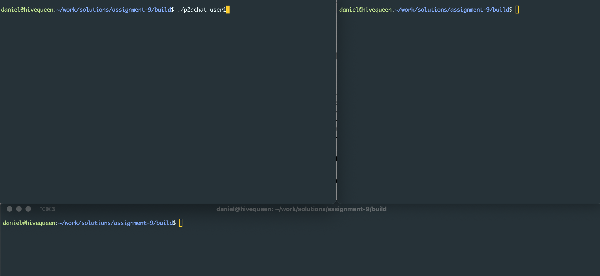
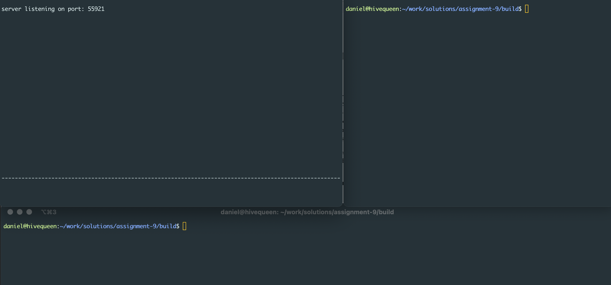
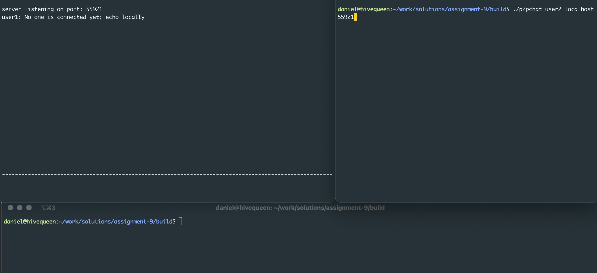
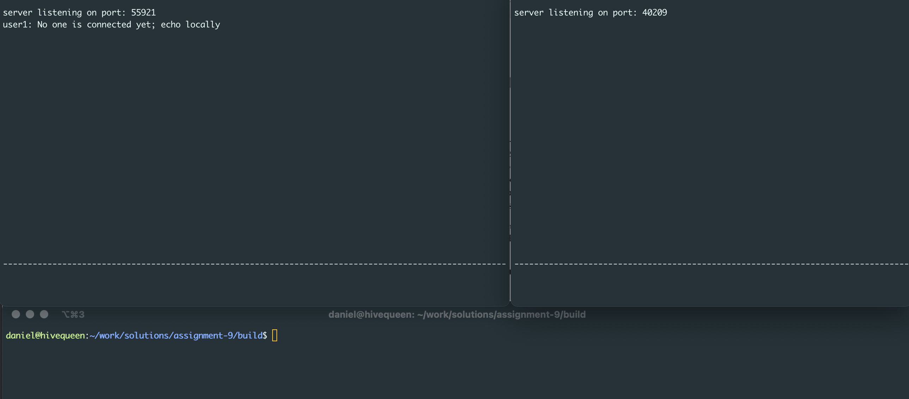
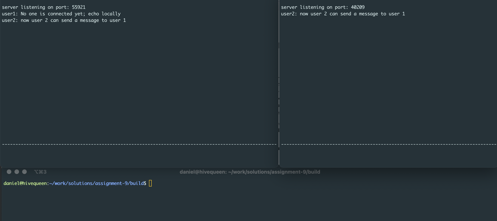
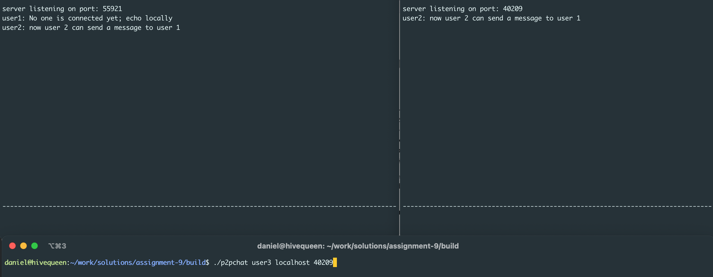
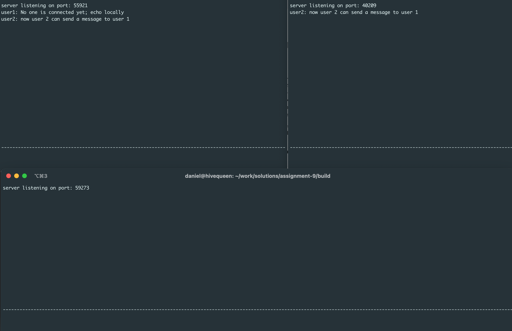
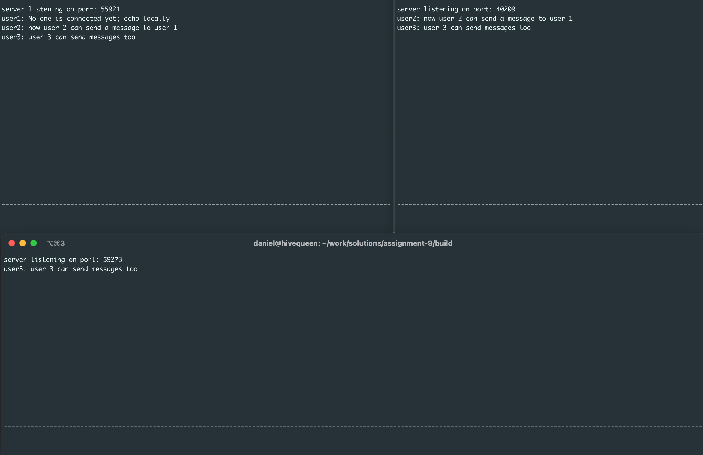
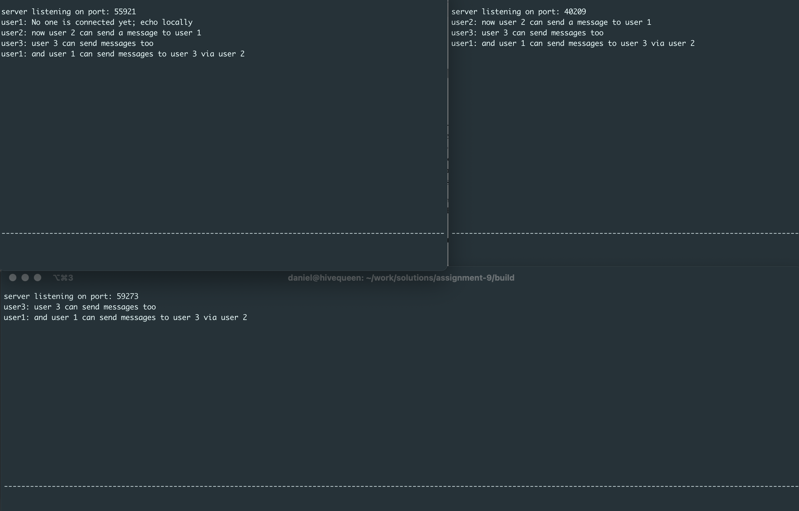

Assignment 9
=============

**Due: November 21, 2022 11:59 PM US Central Time**. Push to GitHub to submit the assignment. This assignment can be done in groups of two, or you may work by yourself if you wish. If you work with a partner, both partners should submit a repo, and you should put the names of both partners in a file named ```partner.md``` in the top-level directory of your repo. Make sure that your repository is shared only with your partner; do not share your code or repos with anyone else.

For this assignment, you will implement a chat program that allows you to exchange messages among processes without the need for a central server. The technique we will use is known as peer-to-peer networking. Instead of connecting to a central server, all users serve as both clients and servers in the network. Joining the network at any point connects you to all users in the network.

## Provided Code
The starter code includes an implementation of a simple user interface built using ncurses. To start the program, run the following command:
```
$ ./p2pchat student
```
This will replace your terminal window with a display that has two fields. When you type, you should see text appear in the lower field. If you hit enter, the message you typed should appear in the upper field, and the lower input field should be cleared. To exit, type the command **:quit** and hit enter. Verify that all of this interface works before moving on.

The functions that build and update this user interface are declared in `ui.h`, and implemented in `ui.c`. You should not need to review the implementation in any detail, but you may want to refer to the comments in `ui.h`.

If you look at `p2pchat.c`, you will see basic uses of all the user interface functions. At startup, the program calls `ui_init(input_callback)`. This function initializes the user interface and registers a callback function. The callback function is run every time the user presses enter in a non-empty input field.

After initializing the user interface, the starter code calls `ui_run`. This function does not return as long as the program is actively running. Any other work you need to do while the user interface is running will have to happen in other threads.

If you move up to the `input_callback(const char* message)` function, you can see the other two interactions with the user interface. This function runs each time the user types in a message and hits enter. In the normal case, the starter code passes this message on to the display using the `ui_display` function. However, if the message was **:quit** or **:q**, the starter code calls `ui_exit`. This causes the `ui_run` function to return, and the program will exit.

## Tasks
Your task for this lab is to implement a network chat system using this starter code. Note that this program will not have separate server and client programs. Instead, every **p2pchat** program will serve as both a client and a server. Every time you start a chat program it will create a server socket and listen for incoming connections. Any peers that connect to the current program are joining the chat network.
To start a new chat network, run the command:
```
$ ./p2p student
```
If you specify a peer on the command line, the program will also connect to that peer to join an existing chat network. The starter code includes some basic code to access the command line arguments, but does not include any of the networking code. To start a program and join an exiting network, run the command:
```
$ ./p2pchat other-student localhost port_number
```
You will need to replace port_number with the port number the existing peer is listening on.

Regardless of how the network is structured, all users in the network should receive messages sent from any other point in the network. To implement this, you will need to handle two cases:
* When the local user types in a message, you should display the message locally and send it to all your peers.
* When a peer sends you a message, you should display it and send it to all your other peers.

It is up to you to determine how you send messages, but make sure you include both the username and message text in the data you send to over the network. You may find it easier to use `read` and `write` to receive and send data to peers, respectively. The following are additional notes to follow:
* `input_callback` function – Modify this function to send a message to the other peers after users hit enter for a non-quit text. Note that the message consists of a username, colon, and a custom text that users provide on console.
* Thread functions – Any existing peer in a network should accept new connections. To do this, you should create a thread function that keeps checking its socket for accepting the new connections. You should also have a thread function that receives a message, displays the message, and forwards it to the other connected peers.
* Storage for sockets of connected peers – Because each peer sends or forwards a message to all the connected peers, it should save peers sockets in a type of storage. Make sure to come up with a data structure for storing sockets. Note that when multiple peers attempt to access a shared data structure, your program should synchronize their accesses to prevent potential race conditions.

Complete your implementation and verify that it can forward messages through the network. Test your implementation with a simple network structure, where all peers are connected to a central peer. When the central peer receives a message, it forwards that message to the other connected peers. Given the central peer for this network structure, your implementation should allow another existing peer to accept new connections from incoming peers. Test your program with one central peer and at least two other connected peers.

Below are some screenshots that show three peers at various stages of execution.

Starting the first peer:



First peer running:



First peer with a locally echoed message and peer 2 about to connect to peer 1:



Peer two connected to peer 1:



After peer 2 typed a message:



A third peer about to connect to peer 2:



Third peer connected:



After third peer types a message:



After first (the original) peer types a message:



## Acknowledgement:
This assignment is based on an original assignment created by Charlie Curtsinger of Grinnell College.
